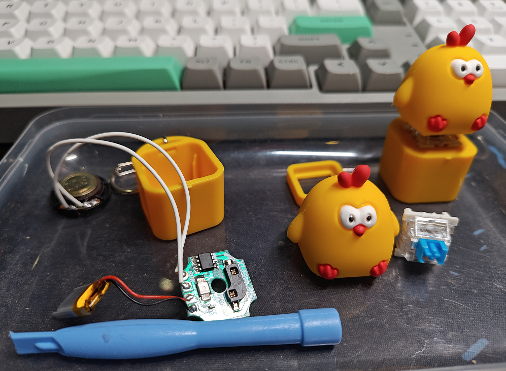

{{ page.title }}
===========

买了仨钵钵鸡给娃。它用到了机械键盘按键，每按一次播放一句；一共三句循环播放；按住不放直接循环播放全部。

突然想到能不能给它换个语音，于是拆了开来。

* 八脚flash芯片
* 锂电池
* 扬声器
* LED彩灯
* 按键通路针脚
* 电阻

不太懂flash芯片，之前最多给路由器刷过系统，但应该能搞定，下一步是：

* 买个编程器
* 读取固件
* 瞎分析下找到音频部分
* 处理鸡神音频，使编码跟这里一致，长度也基本一致
* 替换音频部分
* 写入固件

希望能搞定。
